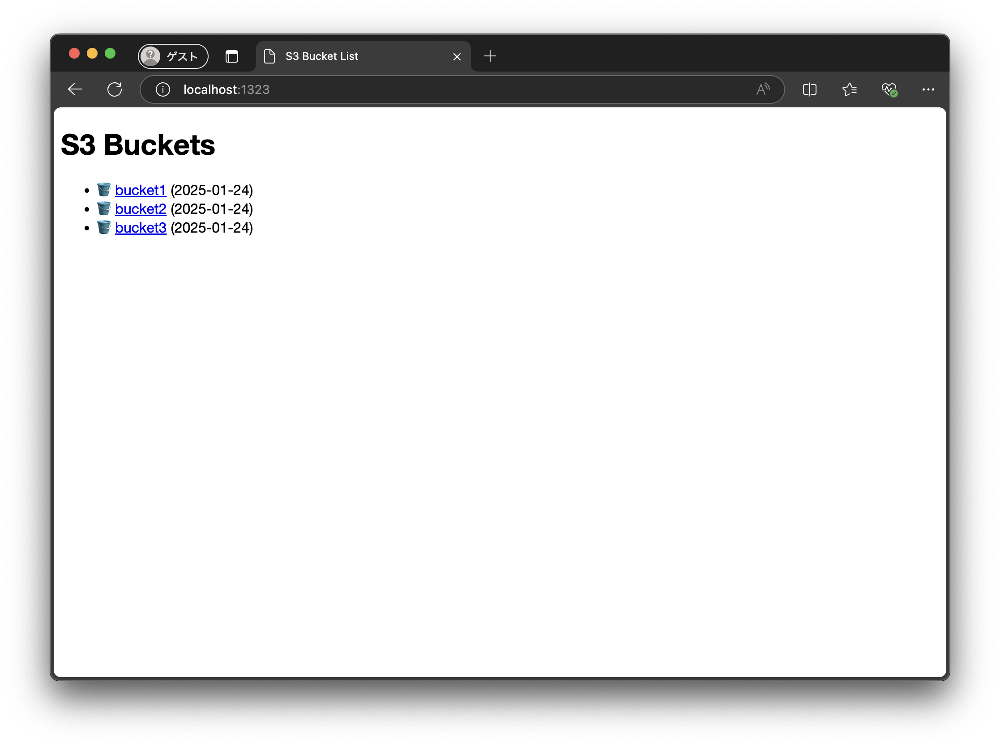
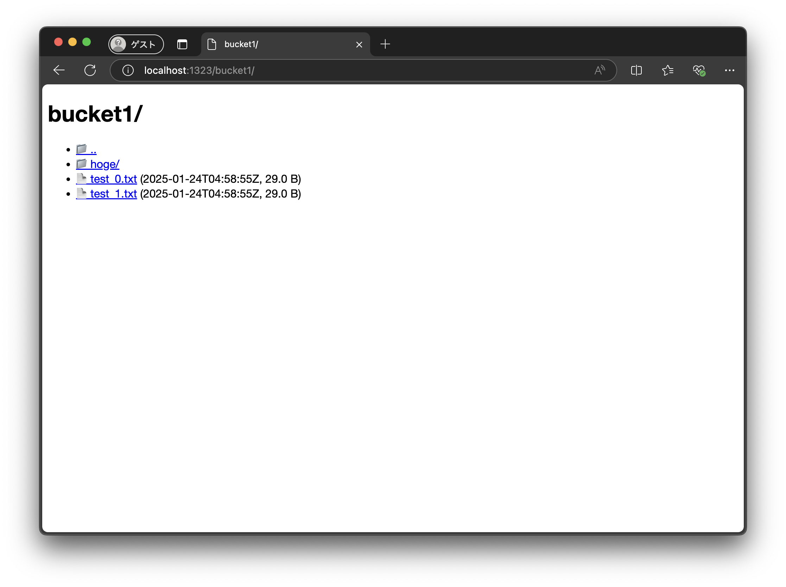
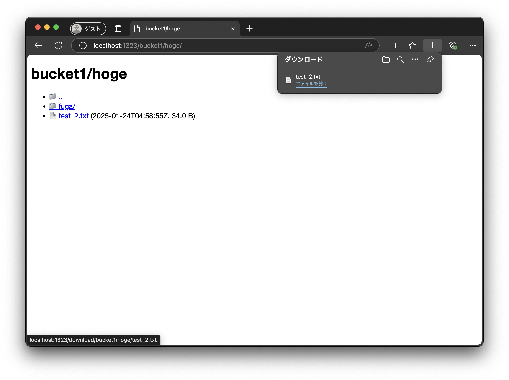

# polybuckets - Simple browser app for S3 compatible services.

| Top page | Bucket root | Bucket child |
|:--------:|:-----------:|:------------:|
| |  |  |

## Features
- List buckets
- List objects in a bucket
- Download an object

## Getting Started

```console
export AWS_REGION=
export AWS_ACCESS_KEY_ID=
export AWS_SECRET_ACCESS_KEY=
export AWS_ENDPOINT=  # optional

go run ./main.go
```


## Development

### 1. Launch development S3 bucket (Terminal A)

```console
cd tools
./init-minio.sh
./start-minio.sh
```

### 2. Launch polybuckets (Terminal B)

```console
set -a; eval "$(cat ./.env <(echo) <(declare -x))"; set +a;  # Load .env

go run ./main.go
```

### 3. Output

Open localhost:1323 in your browser.

Access log is shown in Terminal A.

```console
❯ go run ./main.go

   ____    __
  / __/___/ /  ___
 / _// __/ _ \/ _ \
/___/\__/_//_/\___/ v4.13.3
High performance, minimalist Go web framework
https://echo.labstack.com
____________________________________O/_______
                                    O\
⇨ http server started on 127.0.0.1:1323
{"time":"2025-01-24T14:00:03.178434+09:00","id":"","remote_ip":"127.0.0.1","host":"localhost:1323","method":"GET","uri":"/","user_agent":"Mozilla/5.0 (Macintosh; Intel Mac OS X 10_15_7) AppleWebKit/537.36 (KHTML, like Gecko) Chrome/132.0.0.0 Safari/537.36 Edg/132.0.0.0","status":200,"error":"","latency":7277916,"latency_human":"7.277916ms","bytes_in":0,"bytes_out":531}
{"time":"2025-01-24T14:00:04.508854+09:00","id":"","remote_ip":"127.0.0.1","host":"localhost:1323","method":"GET","uri":"/bucket1/","user_agent":"Mozilla/5.0 (Macintosh; Intel Mac OS X 10_15_7) AppleWebKit/537.36 (KHTML, like Gecko) Chrome/132.0.0.0 Safari/537.36 Edg/132.0.0.0","status":200,"error":"","latency":5368375,"latency_human":"5.368375ms","bytes_in":0,"bytes_out":771}
SDK 2025/01/24 14:00:05 WARN Response has no supported checksum. Not validating response payload.
{"time":"2025-01-24T14:00:05.185905+09:00","id":"","remote_ip":"127.0.0.1","host":"localhost:1323","method":"GET","uri":"/download/bucket1/test_0.txt","user_agent":"Mozilla/5.0 (Macintosh; Intel Mac OS X 10_15_7) AppleWebKit/537.36 (KHTML, like Gecko) Chrome/132.0.0.0 Safari/537.36 Edg/132.0.0.0","status":200,"error":"","latency":6043958,"latency_human":"6.043958ms","bytes_in":0,"bytes_out":0}
```

minio api call log is shown in Terminal B.

```console
❯ ./start-minio.sh
[+] Running 2/2
 ✔ Container tools-minio-1  Running                                                                                                                                                                     0.0s
 ✔ Container tools-mc-1     Running                                                                                                                                                                     0.0s
Attaching to mc-1, minio-1
mc-1     | 2025-01-24T05:00:03.175 [200 OK] s3.ListBuckets localhost:9000/?x-id=ListBuckets  192.168.107.1    979µs       ⇣  958.793µs  ↑ 131 B ↓ 545 B
mc-1     | 2025-01-24T05:00:04.504 [200 OK] s3.ListObjectsV2 localhost:9000/bucket1?delimiter=%2F&list-type=2&prefix=  192.168.107.1    3.222ms      ⇣  3.172337ms  ↑ 131 B ↓ 721 B
mc-1     | 2025-01-24T05:00:05.181 [200 OK] s3.GetObject localhost:9000/bucket1/test_0.txt?x-id=GetObject  192.168.107.1    2.83ms       ⇣  2.69067ms  ↑ 131 B ↓ 29 B
mc-1     | 2025-01-24T05:00:06.284 [200 OK] s3.ListObjectsV2 localhost:9000/bucket1?delimiter=%2F&list-type=2&prefix=hoge%2F  192.168.107.1    2.098ms      ⇣  2.070085ms  ↑ 131 B ↓ 534 B
mc-1     | 2025-01-24T05:00:07.179 [200 OK] s3.ListObjectsV2 localhost:9000/bucket1?delimiter=%2F&list-type=2&prefix=hoge%2Ffuga%2F  192.168.107.1    1.743ms      ⇣  1.718877ms  ↑ 131 B ↓ 484 B
mc-1     | 2025-01-24T05:16:32.180 [200 OK] s3.ListBuckets localhost:9000/?x-id=ListBuckets  192.168.107.1    6.546ms      ⇣  5.283506ms  ↑ 131 B ↓ 545 B
mc-1     | 2025-01-24T05:16:52.136 [200 OK] s3.ListObjectsV2 localhost:9000/bucket1?delimiter=%2F&list-type=2&prefix=  192.168.107.1    6.113ms      ⇣  6.085994ms  ↑ 131 B ↓ 721 B
mc-1     | 2025-01-24T05:17:03.037 [200 OK] s3.ListObjectsV2 localhost:9000/bucket1?delimiter=%2F&list-type=2&prefix=hoge%2F  192.168.107.1    14.505ms     ⇣  14.471377ms  ↑ 131 B ↓ 534 B
mc-1     | 2025-01-24T05:17:05.919 [200 OK] s3.GetObject localhost:9000/bucket1/hoge/test_2.txt?x-id=GetObject  192.168.107.1    5.577ms      ⇣  5.317323ms  ↑ 131 B ↓ 34 B
```
